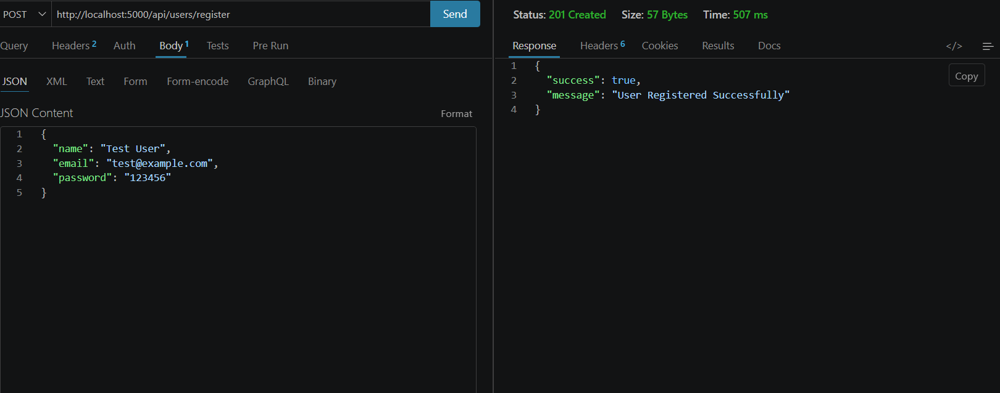
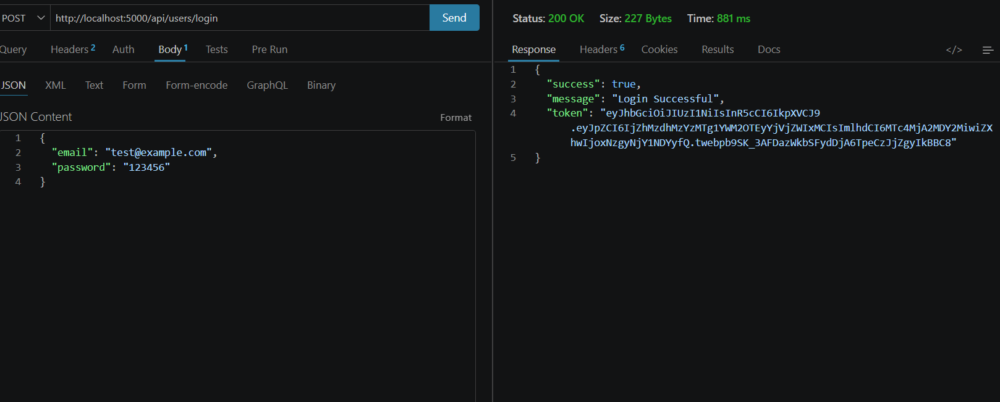
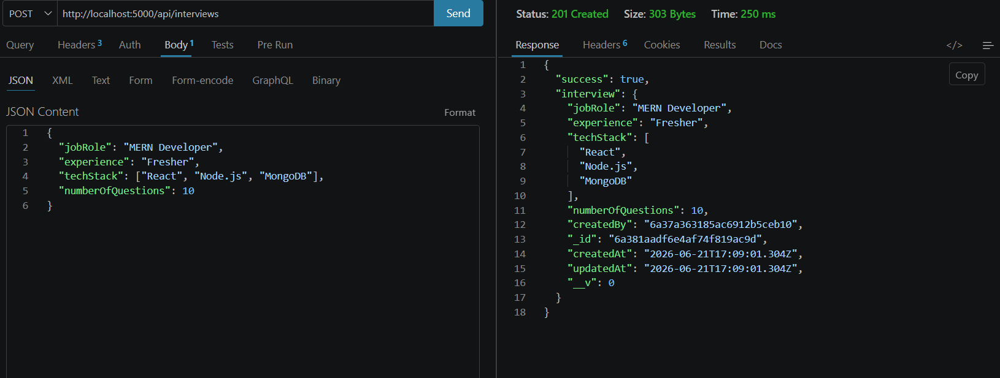

# AI Interview Platform

An AI-powered interview preparation platform built with the MERN Stack that helps users prepare for technical interviews through authentication, interview management, AI-generated questions, and personalized interview sessions.

## Features Implemented

* User Registration
* User Login
* JWT Authentication
* Protected Routes
* Get Current User API
* Create Interview API
* MongoDB Integration
* Password Hashing with bcrypt

## Tech Stack

### Backend

* Node.js
* Express.js
* MongoDB
* Mongoose
* JWT Authentication
* bcryptjs

## API Endpoints

### User Routes

POST /api/users/register

POST /api/users/login

GET /api/users/me

### Interview Routes

POST /api/interviews

## Project Status

Backend Authentication Module Completed.

Currently working on:

* AI Question Generation
* Interview Session APIs
* Frontend Integration
* Resume Analysis

## Screenshots

### User Registration API

Creates a new user account successfully.

---

### User Login API

Authenticates the user and returns a JWT token.

---

### Create Interview API (Protected Route)

Creates an interview record using JWT authentication and stores it in MongoDB.

# Future Enhancements

* AI-powered Question Generation
* Resume Parsing and Analysis
* Voice-based Mock Interviews
* Performance Feedback System
* Full MERN Dashboard

## Author

Liean J Chacko
B.Tech Computer Science Engineering
CUSAT
    